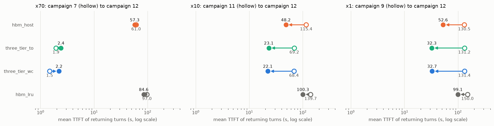

# Campaign 12 — users arrive and leave: campaigns 7/8/9 with Poisson arrivals and varied lengths (2026-10-01 to 10-03)

Campaigns 7, 8 and 9 (gap scales x70, x10, x1) rerun with the same trace, conversations, pools and arms and the same
total volume, but users now come and go. The 128 conversations arrive as a Poisson process at 0.2/s (seed 0; the last
arrives at 12.3 min), and each replays min(recorded turns, U[30, 50]) turns (seed 120). So conversations end at
different times, and the middle of each run has a period in which most conversations are active (peak 108-128 of 128).
Setup, rate choice, wall caps, the outage and the frozen engine: `DECISIONS.md`.

| arm | server |
|---|---|
| `hbm_host` | HiCache host tier, write-through: L1 668,160 tokens + L2 160 GB (1,627,648 tokens) |
| `three_tier_to` | + nixl L3 on the attached SSD (wiped before boot), `timeout` prefetch |
| `three_tier_wc` | same, `wait_complete` prefetch |
| `hbm_lru` | no HiCache, radix LRU, L1 only |

Workload: 128 conversations of the 262K agentic trace (offset 32), 4,671 turns and 112.4M prompt tokens (campaigns 7-9:
4,676 and 112.2M); recorded gaps x70 / x10 / x1, capped at 1,200 s; wall cap 12,600 s (x70) and 9,736 s (x10, x1) per
arm. Qwen3-30B-A3B-Instruct-2507, bf16 KV, one H200.

**Baselines.** Campaign 12 runs the merged engine (upstream #39283: admission-time SSD re-query, paced retries 8/8)
with a client that has no connection cap. Campaigns 7-9 ran the pre-merge fork and a client capped at 100 connections;
campaign 11 is campaign 8 on the merged engine and client. So x10 has a clean burst baseline (campaign 11). At x70 and x1
the non-SSD arms can be compared with campaigns 7 and 9, since campaign 11 showed the engine and client change leaves them
unchanged (x10: `hbm_host` 115.4 vs 114.8 s, `hbm_lru` 139.7 vs 138.7 s). For the SSD arms at x1, the change against
campaign 9 combines the arrival pattern with the re-query. At x70 the re-query path is idle (below), so campaign 7 stays a
fair baseline there.

Files, per scale in `x70/`, `x10/`, `x1/`: `live_timeline.png` and `live_phases.csv` (live conversations and TTFT over
time; statistics per phase, with the burst baseline), `stats.csv` and `paired.csv` (whole run; same-turn differences),
`compare.png`, `compare.csv`, `timeline_<arm>.png`, `turns_<arm>.csv`, `events_<arm>.csv`; also `x70/read_backlog*.png`
and `summary.png` (mean TTFT per arm, burst baseline to campaign 12). Manifests `manifest_x<scale>.txt`, SSD samples
`iostat_vdc_x<scale>.log`. Regenerate from `scripts/` (the figures in the container):

```
python3 live_timeline.py --manifest ../results/campaign12/manifest_x70.txt --label "x70, campaign 12" --ref ../results/compare_20260922_023714/manifest.txt --ref-label c7 --out ../results/campaign12/x70
python3 timeline.py --manifest ../results/campaign12/manifest_x70.txt --out ../results/campaign12/x70
python3 vs_baseline.py --c12 ../results/campaign12/manifest_x70.txt --base ../results/compare_20260922_023714/manifest.txt --base-label c7 --iostat-c12 ../results/campaign12/iostat_vdc_x70.log --iostat-base ../results/compare_20260922_023714/iostat_vdc.log --out ../results/campaign12/x70
python3 read_backlog.py --manifest ../results/campaign12/manifest_x70.txt --out ../results/campaign12/x70 --thread three_tier_to three_tier_wc
python3 requery_share.py $(awk '/^three_tier/ {print "../results/" $2}' ../results/campaign12/manifest_x*.txt)
python3 c12_summary.py --scale x70=../results/campaign12/x70 --scale x10=../results/campaign12/x10 --scale x1=../results/campaign12/x1 --out ../results/campaign12/summary.png
```
(x10: baseline `compare_20261001_013443` labelled c11; x1: `compare_20260923_031116`, c9.)

## Shape of the load

| | x70 | x10 | x1 |
|---|---|---|---|
| conversations that ended before the last arrival (12.3 min) | 0 | 11 (`hbm_lru` 3) | 20 (`hbm_lru` 7) |
| peak live conversations | 128 | 117 (`hbm_lru` 125) | 108 (`hbm_lru` 121) |
| peak phase ends (live < 90 % of the peak), min: SSD arms / `hbm_host` / `hbm_lru` | 28.5-29.7 / 53.6 / 72.2 | 20.4-21.6 / 27.0 / 50.5 | 21.8-22.2 / 28.2 / 41.9 |
| conversation lifetime, median, min: SSD arms / `hbm_host` / `hbm_lru` | 36-38 / 94 / 124 | 34-35 / 66 / 112 | 41 / 66 / 107 |

`x<scale>/live_timeline.png` shows the live count and the TTFT over time. Without load the median conversation (37
turns) would need about 32 min at x70, 6-7 min at x10 and 2-3 min at x1: its gaps plus 2-4 s per turn. Under load it
lives 34-41 min on the SSD arms and 66-94 min on `hbm_host`. So departures are set by each arm's queueing as much as by
the gaps, and the same arrivals produce peaks of different lengths per arm.

## Result



Returning turns, whole run. Campaign 12 first, the burst baseline in parentheses or on its own row. "Same turn" is the mean
TTFT difference over the (conversation, turn) pairs both campaigns ran, with a 95 % bootstrap CI. Returns are
classified by where the prefix was found; a return counts as recompute when more than half of its private prompt was
uncached.

### x70 against campaign 7

| | hbm_host | three_tier_to | three_tier_wc | hbm_lru |
|---|---|---|---|---|
| turns / errors | 4,671 / 0 | 4,671 / 0 | 4,671 / 0 | 4,671 / 0 |
| client wall (s) | 8,734 (9,155) | 5,328 (5,327) | 5,263 (5,148) | 11,386 (11,429) |
| 90 % of conversations ended (min) | 118.5 (115.3) | 62.3 (56.3) | 60.7 (55.1) | 160.2 (157.2) |
| TTFT mean / p50 / p90 / p99 (s) | 57.3 / 0.59 / 180.9 / 192.7 | 2.41 / 0.29 / 7.13 / 34.1 | 2.21 / 0.28 / 9.11 / 23.2 | 84.6 / 84.5 / 183.5 / 197.1 |
| campaign 7 | 61.0 / 0.98 / 184.1 / 210.1 | 1.94 / 0.32 / 6.81 / 17.5 | 1.48 / 0.29 / 4.50 / 16.8 | 97.0 / 92.9 / 200.6 / 224.2 |
| same turn, campaign 12 − 7 (s) | −1.7 [−3.2, −0.1] | +0.48 [+0.30, +0.67] | +0.77 [+0.62, +0.94] | −9.4 [−10.5, −8.2] |
| server queue wait, mean (s); campaign 7 did not log it | 55.7 | 2.0 | 1.9 | 82.0 |
| returns: device / host / SSD / recompute | 1,228 / 1,503 / 0 / 1,812 | 1,648 / 1,863 / 825 / 207 | 1,800 / 1,782 / 867 / 94 | 773 / 0 / 0 / 3,770 |
| prefill tokens, all turns (M) | 38.2 (39.6) | 4.8 (4.4) | 2.8 (2.7) | 68.4 (70.4) |
| SSD read / written (TB); utilization mean / p90 | — | 1.65 / 0.54; 18 % / 99 % (1.79 / 0.51; 18 % / 88 %) | 1.64 / 0.35; 17 % / 99 % (1.65 / 0.34; 16 % / 60 %) | — |

Same turn within each campaign: `three_tier_to` − `hbm_host` −54.9 s [−57.1, −52.7] (campaign 7: −59.1 s);
`three_tier_wc` − `three_tier_to` −0.20 s (−0.46 s); `hbm_lru` − `hbm_host` +27.3 s (+36.0 s).

| TTFT mean / p90 (s), span (min) | arrival | peak | departure |
|---|---|---|---|
| `hbm_host` | 0.23 / 0.49, 0-12.3 | 56.5 / 180.0, 12.3-53.6 | 105.9 / 185.5, 53.6-145.6 |
| `three_tier_to` | 0.24 / 0.48, 0-12.3 | 2.72 / 6.70, 12.3-29.7 | 3.61 / 14.2, 29.7-88.8 |
| `three_tier_wc` | 0.24 / 0.51, 0-12.3 | 1.93 / 4.95, 12.3-28.5 | 4.07 / 17.9, 28.5-87.7 |
| `hbm_lru` | 1.76 / 6.85, 0-12.3 | 89.7 / 165.7, 12.3-72.2 | 132.2 / 191.3, 72.2-189.8 |

### x10 against campaign 11 (same engine and client)

| | hbm_host | three_tier_to | three_tier_wc | hbm_lru |
|---|---|---|---|---|
| turns / errors / conversations cut by the wall cap | 4,671 / 0 / 0 (4,667 / 0 / 2) | 4,671 / 0 / 0 (4,676 / 0 / 0) | 4,671 / 0 / 0 (4,676 / 0 / 0) | 4,662 / 0 / 2 (4,543 / 0 / 27) |
| client wall (s) | 6,491 (9,013 cap) | 4,674 (6,919) | 4,625 (6,963) | 9,736 cap (9,062 cap) |
| 90 % of conversations ended (min) | 81.3 (127.0) | 50.5 (82.2) | 49.5 (81.2) | 150.2 (150.5) |
| TTFT mean / p50 / p90 / p99 (s) | 48.2 / 11.0 / 155.4 / 171.8 | 23.1 / 10.2 / 80.3 / 98.6 | 22.1 / 10.0 / 74.6 / 95.5 | 100.3 / 115.8 / 186.2 / 197.8 |
| campaign 11 | 115.4 / 134.3 / 252.1 / 266.7 | 69.2 / 79.3 / 145.1 / 169.8 | 68.4 / 74.7 / 144.1 / 174.5 | 139.7 / 146.2 / 252.8 / 266.3 |
| same turn, campaign 12 − 11 (s) | −64.4 [−67.3, −61.5] | −44.9 [−46.5, −43.2] | −45.1 [−46.7, −43.4] | −34.8 [−36.6, −33.0] |
| server queue wait, mean (s) | 46.9 (113.4) | 22.4 (67.9) | 21.5 (67.1) | 97.7 (137.0) |
| returns: device / host / SSD / recompute | 1,003 / 2,113 / 0 / 1,427 | 1,006 / 2,430 / 548 / 559 | 1,012 / 2,440 / 563 / 528 | 832 / 0 / 0 / 3,702 |
| campaign 11 | 550 / 1,461 / 0 / 2,528 | 603 / 1,434 / 1,150 / 1,361 | 594 / 1,457 / 1,158 / 1,339 | 440 / 0 / 0 / 3,975 |
| prefill tokens, all turns (M) | 28.2 (52.5) | 11.5 (28.6) | 10.9 (28.2) | 65.9 (70.0) |
| SSD read / written (TB); utilization mean / p90 | — | 1.00 / 1.18; 18 % / 50 % (2.30 / 2.83; 26 % / 59 %) | 1.02 / 1.13; 17 % / 50 % (2.30 / 2.79; 26 % / 59 %) | — |

Same turn within each campaign: `three_tier_to` − `hbm_host` −25.1 s [−26.2, −23.9] (campaign 11: −46.1 s);
`three_tier_wc` − `three_tier_to` −0.97 s (−0.83 s); `hbm_lru` − `hbm_host` +52.0 s (+21.0 s). Against campaign 8 (old
engine, where the SSD arms tracked `hbm_host`): `hbm_host` −63.8 s, `three_tier_to` −90.5 s, `three_tier_wc` −91.8 s,
`hbm_lru` −33.9 s.

| TTFT mean / p90 (s), span (min) | arrival | peak | departure |
|---|---|---|---|
| `hbm_host` | 3.89 / 11.2, 0-12.3 | 65.7 / 141.2, 12.3-27.0 | 89.9 / 164.8, 27.0-108.2 |
| `three_tier_to` | 3.90 / 11.4, 0-12.3 | 36.7 / 86.8, 12.3-21.6 | 38.1 / 87.9, 21.6-77.9 |
| `three_tier_wc` | 3.94 / 11.6, 0-12.3 | 33.3 / 85.0, 12.3-20.4 | 37.1 / 85.9, 20.4-77.1 |
| `hbm_lru` | 7.65 / 28.6, 0-12.3 | 109.0 / 146.4, 12.3-50.5 | 154.5 / 192.7, 50.5-162.3 |

43 % of `hbm_host`'s returning turns (1,960 of 4,543) fall in the 12.3-minute arrival phase, at 3.9 s mean.

### x1 against campaign 9

| | hbm_host | three_tier_to | three_tier_wc | hbm_lru |
|---|---|---|---|---|
| turns / errors / conversations cut by the wall cap | 4,671 / 0 / 0 (4,676 / 0 / 0) | 4,671 / 0 / 0 (4,676 / 0 / 0) | 4,671 / 0 / 0 (4,676 / 0 / 0) | 4,671 / 0 / 0 (4,561 / 0 / 29) |
| client wall (s) | 5,449 (8,628) | 3,886 (8,687) | 3,908 (8,679) | 9,293 (9,110 cap) |
| 90 % of conversations ended (min) | 80.3 (133.5) | 54.3 (134.3) | 54.6 (134.2) | 145.5 (151.5) |
| TTFT mean / p50 / p90 / p99 (s) | 52.6 / 15.6 / 164.8 / 182.7 | 32.3 / 15.0 / 101.8 / 119.7 | 32.7 / 14.8 / 103.2 / 124.0 | 99.1 / 115.5 / 187.5 / 203.4 |
| campaign 9 | 130.5 / 150.6 / 262.3 / 279.5 | 131.2 / 148.9 / 261.8 / 279.3 | 131.4 / 149.3 / 262.3 / 278.7 | 150.0 / 155.2 / 264.4 / 280.3 |
| same turn, campaign 12 − 9 (s) | −75.2 [−78.2, −72.1] | −96.3 [−99.2, −93.4] | −96.1 [−99.0, −93.3] | −45.9 [−48.0, −43.6] |
| server queue wait, mean (s) | 51.3 (108.9) | 31.5 (109.4) | 31.9 (109.5) | 96.6 (122.1) |
| returns: device / host / SSD / recompute | 968 / 2,160 / 0 / 1,415 | 966 / 2,275 / 617 / 685 | 972 / 2,266 / 610 / 695 | 944 / 0 / 0 / 3,599 |
| campaign 9 | 494 / 1,274 / 0 / 2,780 | 495 / 1,242 / 3 / 2,808 | 498 / 1,236 / 2 / 2,812 | 423 / 0 / 0 / 4,010 |
| prefill tokens, all turns (M) | 28.3 (56.7) | 14.4 (57.1) | 14.5 (57.2) | 63.9 (70.6) |
| SSD read / written (TB); utilization mean / p90 | — | 1.14 / 1.46; 24 % / 55 % (0.03 / 5.57; 20 % / 29 %) | 1.13 / 1.48; 25 % / 57 % (0.02 / 5.57; 20 % / 29 %) | — |

Same turn within each campaign: `three_tier_to` − `hbm_host` −20.3 s [−21.2, −19.4] (campaign 9: +0.66 s);
`three_tier_wc` − `three_tier_to` +0.40 s (+0.24 s); `hbm_lru` − `hbm_host` +46.6 s (+16.2 s).

| TTFT mean / p90 (s), span (min) | arrival | peak | departure |
|---|---|---|---|
| `hbm_host` | 6.35 / 16.2, 0-12.3 | 73.6 / 154.2, 12.3-28.2 | 101.0 / 174.0, 28.2-90.8 |
| `three_tier_to` | 6.42 / 16.2, 0-12.3 | 41.5 / 92.4, 12.3-21.8 | 60.9 / 113.0, 21.8-64.8 |
| `three_tier_wc` | 6.38 / 16.0, 0-12.3 | 43.3 / 90.0, 12.3-22.2 | 61.1 / 113.9, 22.2-65.1 |
| `hbm_lru` | 8.61 / 34.5, 0-12.3 | 106.2 / 127.6, 12.3-41.9 | 154.7 / 196.4, 41.9-154.9 |

45 % of `hbm_host`'s returning turns (2,060 of 4,543) fall in the arrival phase, at 6.4 s mean.

## What it shows

1. **At x70, staggering the arrivals changes little.** At x70 a conversation lives 36 min to 2 h, so all 128 are live
   at 12.3 min and at least 90 % of them until 28-72 min. After the first quarter hour the run looks like campaign 7,
   whose host-pool arms also kept the median TTFT under 0.5 s for about 15 minutes. Every arm lands within 10 s per turn
   of campaign 7 (`hbm_host` −1.7 s, `hbm_lru` −9.4 s), and the SSD tier keeps its advantage over the host tier
   (`three_tier_to` − `hbm_host`: −54.9 s per turn; campaign 7: −59.1 s).
2. **At x70, the SSD arms' tails grow, from one burst of restores.** `three_tier_to`'s p99 doubles (17.5 → 34.1 s) and
   `three_tier_wc`'s p90 doubles (4.5 → 9.1 s; p99 16.8 → 23.2 s); the means rise by 0.5 and 0.8 s per turn. The live
   set outgrows L2 later than in campaign 7 (first host eviction at 15.3 vs 9.1 min), so restores start later and are
   squeezed into less time: 91-92 % of them fall between 20 and 40 min, against 74-75 % in campaign 7. In the four
   2-minute bins from 26 to 34 min, 418 of `three_tier_wc`'s 485 restores (86 %) had ≥ 20 GB of reads queued ahead of
   them. Over the whole run, 49 % of `three_tier_wc`'s restores waited behind ≥ 20 GB (campaign 7: 20 %), and 17 % of
   `three_tier_to`'s (5 %). Waiting for the single SSD read thread is 88 % of a restored turn's TTFT under
   `wait_complete` (campaign 7: 80 %) and 60 % under `timeout` (58 %). The SSD's p90 utilization is 99 % in both arms
   (campaign 7: 88 % `timeout`, 60 % `wait_complete`). Figures: `x70/read_backlog*.png`. The engine is not the cause:
   at x70 the #39283 re-query path is idle. Every `three_tier_wc` SSD read came from the lookup made when the request
   arrived, and so did 922 of `three_tier_to`'s 935.
3. **At x10 and x1, staggered arrivals and departures more than halve the host-pool arms' TTFT.** x10 against campaign
   11 (same engine): `hbm_host` 115.4 → 48.2 s, SSD arms 69 → 22-23 s, `hbm_lru` 139.7 → 100.3 s; per turn −64, −45 and
   −35 s. x1 against campaign 9: `hbm_host` 130.5 → 52.6 s and `hbm_lru` 150.0 → 99.1 s (per turn −75 and −46 s). The
   SSD arms' drop from 131 to 32-33 s (−96 s per turn) also includes the re-query (point 4).

   In the burst, all 128 conversations start at once. At x10 the server queues from the first minute (median TTFT
   6.5-14 s over the first 10 min), the live set outgrows L2 at 6.3 min (first host eviction), and from ~10 min the
   median TTFT stays above 130 s for most of the run. Contexts are evicted while their next turns wait, so 56 % of
   `hbm_host`'s returns recompute, and the extra prefill keeps the queue long. In campaign 12 the first 10 minutes run
   at 0.1-0.8 s median. 43 % of the x10 returning turns (x1: 45 %) fall in the 12.3-minute arrival phase, at 3.9 s mean
   (x1: 6.4 s), and the peak is lower (117 of 128; x1: 108) and shorter. Recomputes fall to 31 % of `hbm_host`'s
   returns and prefill work from 52.5M to 28.2M tokens. The arm finishes in 6,491 s, while campaign 11's hit its 9,000-s
   cap with 2 conversations unfinished.
4. **At x10 and x1, the SSD tier still pays, almost entirely through re-issued lookups.** At x10, 545 of the 583 and
   546 of the 584 requests that read from the SSD did so after a re-issued lookup (the #39283 admission re-query or a
   paced retry), a median 64-72 s after the request arrived. At x1 the counts are 620 of 630 and 606 of 616, 91-92 s
   after arrival. `three_tier_to` saves 25.1 s per turn over `hbm_host` at x10 (campaign 11: 46.1 s) and 20.3 s at x1.
   No campaign-12 arm ran without these lookups. Where they were off (campaigns 8 and 9, and campaign 11's
   `three_tier_wc_norq`), the SSD arms saved nothing against `hbm_host` (+1.1, +0.7 and +0.9 s per turn). The SSD
   arms' mean TTFT is 46-48 % of `hbm_host`'s at x10 (campaign 11: 59-60 %) and 61-62 % at x1.
5. **The prefetch policy moves the mean by 1 s or less.** `three_tier_wc` − `three_tier_to` is −0.2, −1.0 and +0.4 s
   per turn at x70, x10 and x1, and each CI excludes zero. At x70 the tails split: `wait_complete` has the higher p90
   (9.1 vs 7.1 s) and the lower p99 (23.2 vs 34.1 s).
6. **`hbm_lru` gains least**: its mean TTFT falls 28 % at x10 and 34 % at x1 (host-pool arms: 58-75 %). With L1 alone
   it recomputes 82 % and 79 % of its returns there (burst baselines: about 90 %). Its gap to `hbm_host` widens from
   +21.0 s (campaign 11) to +52.0 s per turn at x10, and from +16.2 s (campaign 9) to +46.6 s at x1.

## Notes and deviations

- **Engines.** x70 `hbm_host` and `three_tier_to` ran the engine of `47ceeb6d26` (= `ace8ac79a7`, campaign 11's). x70
  `three_tier_wc` and `hbm_lru` and x10 `hbm_host` ran the working tree with the user's oracle step 2 (`2abe005bb2`;
  the client sends no hints, so the new path is off). From x10 `three_tier_to` on, every arm ran the frozen
  `2abe005bb2` engine (`agent_cache/frozen/engine_2abe005bb2/python`; `run.txt` records it). Details in `DECISIONS.md`.
- **Outage.** The host was down from ~08:33Z to ~14:29Z on 2026-10-02. x10 `three_tier_to`
  (`../20261002_075232_three_tier_to_NAT160`, cut off ~40 min in) was rerun from scratch, and the cut-off run is not
  used.
- **One run per arm, and one draw** of arrivals (seed 0) and lengths (seed 120).
- **Phases are per arm**: arrival is up to the last arrival (12.3 min), and peak lasts until the live count first falls
  below 90 % of the arm's own peak. The burst baselines have no arrival phase.
- **Different turn sets.** Campaign 12 replays turns 41-50 of the longer conversations and drops the tails of shorter
  draws. Whole-run statistics therefore cover different turns of equal total volume, while same-turn differences use
  only the 4,262-4,354 pairs both campaigns ran. Campaign 7's `three_tier_wc` lost two conversations (41 turns) to
  keep-alive resets.
- **Campaigns 7-9 baselines.** Campaign 7 did not log server queue times. The campaigns 7-9 client held at most 100
  connections, so requests beyond 100 waited in the client: campaign 9's mean server queue wait is 21.6-27.9 s below its
  TTFT, against under 3 s in campaigns 11 and 12. At x10, removing the cap (campaign 11 vs 8) moved no non-SSD arm by
  more than 1 s.
- **Wall caps.** x10 `hbm_lru` hit its 9,736-s cap with 2 conversations unfinished (9 turns). x1 `hbm_lru` finished every
  conversation (9,293 s), where campaign 9's hit the cap with 29 unfinished.
- SSD traffic is integrated from `iostat` over each arm's client window. The tier counts use the rule above, so they
  differ from `compare.csv`'s columns.
