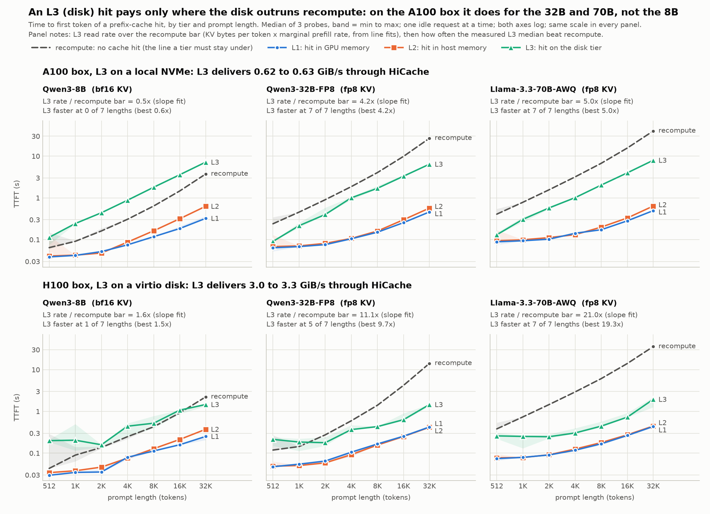

# HiCache Exp 0 / Exp 1 rerun on an A100 box: 70B, 32B, and the three-model picture

Run 2026-09-17 on GCP `a2-ultragpu-1g` (A100-SXM4-80GB, 12 vCPU, 167 GB RAM, PCIe Gen4, L3 on a local NVMe).
Reference: campaign 2, `20260908_llama70b_awq_fp8kv` (H100 PCIe, L3 on a virtio disk). Same image, same commit
under `python/`, same flags, client parameters, seeds, checkpoint snapshots and stage order. What differs is in
`DEVIATIONS.md`. Every number below is in `COMPARISON.md` / `comparison.csv`, computed identically on both sides
by `scripts/compare_campaigns.py` from the raw per-probe files; run against the old campaign alone, that script
reproduces campaign 2's published P, bar and L3 rate for both models exactly.

The 8B rerun (backend A/B, Exp 0, Exp 1) is in `../20260917_a100_gcp_qwen8b`.

## Validity

All 8 stages finished without a failure. Per model: 84 Exp 1 rows (21 per tier), 0 discards, every prompt length
exact, every L1 / L2 / L3 probe a full hit on the intended tier (L - 64 tokens), no recompute row touched by any
tier. Exp 0 attributed 4032 tokens to device, then host, then storage, and wrote exactly `b` bytes per token into
128 L3 files in total. The nixl cleaner never fired (peak disk use 18 %). The 70B's recompute rate on the write-through
server equals the rate on a server without HiCache to three digits (819.69 vs 819.63 tok/s), so the slow disk does
not perturb prefill.

## The three-model table (H100 + virtio disk, then A100 + local NVMe)

`b` = KV bytes per token, `P` = marginal prefill rate (fit over 7 lengths), bar = `b * P`, the rate a tier must
deliver to beat recompute. Speed-up at 16k = recompute median / L3 median at L = 16384, from Exp 1 on both boxes.

| model | b (B/tok) | P (tok/s) | recompute bar (GiB/s) | L2 delivered (GiB/s) | L3 delivered (GiB/s) | L3 / bar | L3 speed-up @16k |
|---|---:|---:|---:|---:|---:|---:|---:|
| Qwen3-8B bf16 KV, old | 147456 | 15011 | 2.061 | 12.87 | 3.277 | 1.59 | 0.86x |
| Qwen3-8B bf16 KV, **new** | 147456 | 8858 | 1.216 | 7.38 | 0.625 | **0.51** | 0.41x |
| Qwen3-32B-FP8 fp8 KV, old | 131072 | 2336 | 0.285 | 10.41 | 3.176 | 11.1 | 6.6x |
| Qwen3-32B-FP8 fp8 KV, **new** | 131072 | 1226 | 0.150 | 7.75 | 0.623 | **4.2** | 3.0x |
| Llama-3.3-70B-AWQ fp8 KV, old | 163840 | 920 | 0.140 | 13.09 | 2.952 | 21.0 | 19.3x |
| Llama-3.3-70B-AWQ fp8 KV, **new** | 163840 | 820 | 0.125 | 9.01 | 0.629 | **5.0** | 3.9x |

## The same data as curves

Median of 3 probes per point, band = min to max, shared log-log axes. The dashed line is recompute: a tier pays
where its curve is under it. `ttft_by_tier_3models_dark.png` is the same figure on a dark surface; both come
from `scripts/plot_tier_ttft.py`, which reads the raw `ttft_by_tier.csv` files of the old and new campaigns.
The slope-fit ratio in each panel header overstates the speed-up on the old box (recompute is superlinear, so
the fit is set by the two longest lengths); the measured best ratio beside it is the honest upper figure.

## What the rerun shows

1. **The admission criterion holds on different hardware.** L3 delivers 0.62 to 0.63 GiB/s for all three models
   here, as it delivered about 3 GiB/s for all three on the old box: it is model-independent, and here it sits
   at the device's ceiling (iostat: 695 to 704 MiB/s at 97 to 99 % util during the 32512-token L3 probes). The
   bar is what moves. On this box the 8B's bar (1.22 GiB/s) is above what L3 delivers, so an L3 hit loses to
   recompute at every length (1.8x to 2.9x slower). The 32B's and 70B's bars (0.150, 0.125) are below it, so an
   L3 hit wins at every one of the seven lengths for both: at 32512 tokens, 6.4 s against 26.7 s (32B) and 7.9 s
   against 39.9 s (70B).
2. **L3 is the tier that changed most.** It delivers about 5x less than on the old box (fit 0.62 vs 3.0 to 3.3
   GiB/s; differential L3 - L2 0.68 vs 3.8 to 4.6). L1's fitted rate is 5 to 22 % lower; individual L1 medians
   range from 9 % faster to 46 % slower, the largest gaps at 512 to 2048 tokens where the absolute difference is
   under 20 ms. L2's fitted rate is 57 to 74 % of the old one and still clears the bar by 6x (8B), 52x (32B) and
   72x (70B). That L2 figure is not a link measurement: for the two slow models layer-wise loading hides the copy
   behind compute (on the old box their L2 slopes equal their L1 slopes), and the only transfer-like differential,
   the 8B's L2 - L1, fell from 36.7 to 14.1 GiB/s in a pass that, unlike the old one, ran while write-through
   saturated the disk. The slower link (Gen4 x16 here; the old box's `pcie.log` peaks at 40.7 GB/s, which needs
   Gen5), the smaller host and the concurrent backup stream were not separated.
3. **The recompute slowdown depends on the weight kernel, and P hides part of it.** In marginal rate P the 70B
   is 11 % slower, the bf16 8B 41 % (A100 and flashinfer against H100 and fa3) and the 32B 47 %. P is a slope
   dominated by the 16k and 32k points. Per length, the 70B is a flat 1.06x to 1.12x; the 8B is 1.0x to 1.2x at
   1k to 4k tokens and 1.67x at 32512; the 32B is 3.1x to 3.3x slower at 1k to 4k, where the weight GEMMs
   dominate, and 1.9x at 32512. That pattern is consistent with SM80 falling back to weight-only FP8 Marlin where
   the H100 ran DeepGEMM W8A8; GPU and kernel effects cannot be separated for this model. A lower bar is why the
   32B's L3 margin shrank less (2.7x) than L3 delivery did (5x).
4. **For the 32B the L3 crossover moved down, for two reasons.** On the H100 an L3 hit lost at 512 and 1024
   tokens (1.80x, 1.28x of recompute); here it wins from 512 tokens on. Recompute got 2.0x to 3.2x slower at
   these lengths, and the small-hit L3 latency fell (0.21 to 0.09 s at 512 tokens; fit intercept 0.139 to
   0.058 s): the roughly 0.2 s floor the old box showed below 2k tokens is absent here. The recompute slowdown
   alone flips 1024 tokens; at 512 either change would have been enough.

## Caveats

- One box, n = 3 per point, single in-flight probe, idle server: these are tier cost curves, not throughput.
- Only the 70B holds both kernels fixed (triton attention and `awq_marlin` on both boxes), so its 11 % is the
  closest to a GPU-only figure; the host CPU (12 against 26 vCPUs) and the driver version still differ. The 8B
  changes the attention kernel and the 32B the weight kernel; see `DEVIATIONS.md` D3 and D4.
- The L2 passes ran while their own write-through drained to a disk that writes about 0.38 GiB/s (iostat:
  391 MiB/s at 99 % util), as the procedure prescribes; `exp1_*_l2/iostat.log` and `pcie.log` document it.
- No raw fio output was saved for this SSD; the device ceilings quoted here come from the captured iostat logs.
- Exp 2, 3 and 4 were not run on this box (cancelled before they started).
