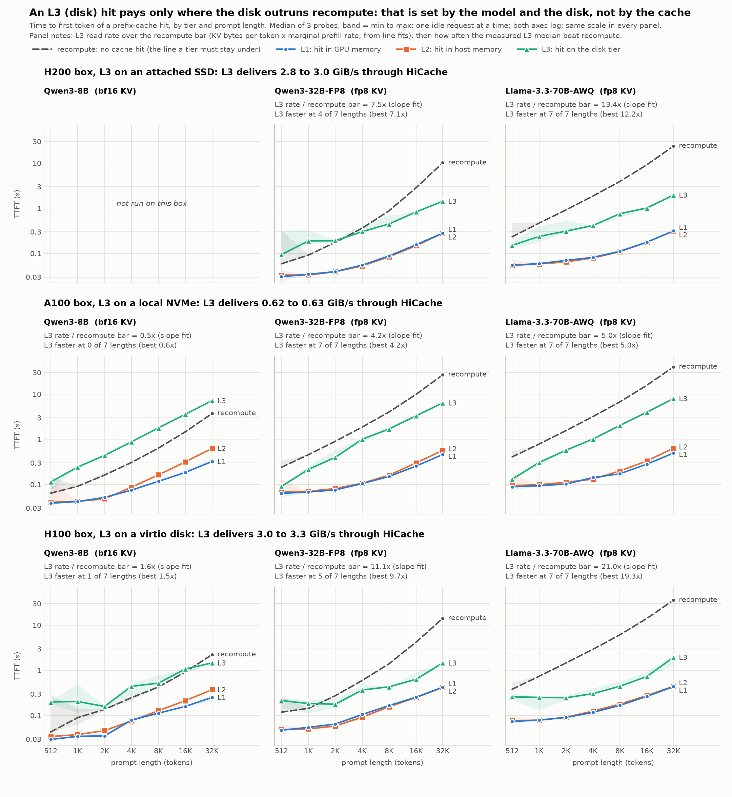

# HiCache Exp 0 / Exp 1 rerun on an H200 box: 70B and 32B against the A100 campaign

Run 2026-09-21 20:46-21:55 UTC on a Nebius H200 instance (143 GB HBM, SM90, 16 vCPU, 196 GB RAM, PCIe Gen5,
L3 on a 2.27 TiB attached SSD that sustains 1.88 GiB/s). Reference: campaign 5, `20260917_a100_gcp_32b70b_fp8kv`
(A100-SXM4-80GB, local NVMe at 0.68 GiB/s read). Same image, same commit under `python/`, same flags except the host
pool size, same client parameters, seeds, checkpoint snapshots and stage order. What differs is in `DEVIATIONS.md`.
Every number below is in `COMPARISON.md` / `comparison.csv`, computed identically on both sides by
`scripts/compare_campaigns.py` from the raw per-probe files (`exp1_*/ttft_by_tier.csv`, `exp0_*/run.log`).

## Validity

All 7 stages finished without a failure (`run_h200.log`). Per model: 84 Exp 1 rows (21 per tier), 0 discards, every
prompt length exact, every L1 / L2 / L3 probe a full hit on the intended tier (>= L - 64 tokens), no recompute row
touched by any tier. Exp 0 attributed 4032 tokens to device, then host, then storage, and wrote exactly `b` bytes per
token into 128 L3 files (671,088,640 B for the 70B, 536,870,912 B for the 32B). The nixl cleaner never logged. The
70B's recompute rate on the write-through server equals the rate on a server without HiCache to three digits
(1382.4 vs 1381.4 tok/s), so backing up to the SSD does not perturb prefill. The one thing not captured is device-side
disk telemetry (every `iostat.log` is empty, `DEVIATIONS.md` D7), so the L3 figures below are fits over TTFT, not a
throughput reading from the device.

## The table (A100 + local NVMe, then H200 + attached SSD)

`b` = KV bytes per token, `P` = marginal prefill rate (fit over 7 lengths), bar = `b * P`, the rate a tier must
deliver to beat recompute. Speed-up at 16k = recompute median / L3 median at L = 16384. The 8B was not rerun here (D9).

| model | b (B/tok) | P (tok/s) | recompute bar (GiB/s) | L2 delivered (GiB/s) | L3 delivered (GiB/s) | L3 / bar | L3 speed-up @16k |
|---|---:|---:|---:|---:|---:|---:|---:|
| Qwen3-32B-FP8 fp8 KV, A100 | 131072 | 1226 | 0.150 | 7.75 | 0.623 | 4.2 | 3.0x |
| Qwen3-32B-FP8 fp8 KV, **H200** | 131072 | 3255 | 0.397 | 15.64 | 2.994 | **7.5** | 3.4x |
| Llama-3.3-70B-AWQ fp8 KV, A100 | 163840 | 820 | 0.125 | 9.01 | 0.629 | 5.0 | 3.9x |
| Llama-3.3-70B-AWQ fp8 KV, **H200** | 163840 | 1382 | 0.211 | 18.89 | 2.828 | **13.4** | 9.0x |

## The same data as curves

Median of 3 probes per point, band = min to max, shared log-log axes; one row per box (this H200, campaign 5's A100,
campaign 2's H100 with its virtio disk), one column per model; the 8B panel of the H200 row is empty (D9). The
dashed line is recompute: a tier pays where its curve is under it. `ttft_by_tier_3models_dark.png` is the same figure
on a dark surface; both come from `scripts/plot_tier_ttft.py`.

## What the rerun shows

1. **Both sides of the admission criterion moved up, and L3's side moved more.** The bar rose 1.69x (70B) and 2.65x
   (32B) because prefill is faster here; L3 delivery rose 4.5-4.8x (fit 2.83 / 2.99 GiB/s against 0.63 / 0.62), so the
   margin over the bar widened from 5.0x to 13.4x for the 70B and from 4.2x to 7.5x for the 32B. At 32512 tokens an
   L3 hit costs 1.95 s against 23.7 s of recompute (70B) and 1.43 s against 10.1 s (32B).
2. **The 32B's crossover moved back up.** On the A100 an L3 hit beat recompute from 512 tokens on; here it loses at
   512, 1024 and 2048 tokens (1.60x, 2.07x, 1.08x of recompute) and wins from 4096 on (0.84x, down to 0.14x at 32512).
   Two things add up: recompute at 512-2048 tokens got 4-5x faster (native FP8 through DeepGEMM instead of weight-only
   Marlin, `DEVIATIONS.md` D3: 0.059 / 0.092 / 0.176 s against 0.239 / 0.455 / 0.902 s), and the small-hit L3 latency did
   not fall (0.094 s at 512 tokens against 0.090; fit intercept 0.120 s against 0.058). The 70B, whose weight kernel is
   the same on both boxes, wins at every length here as it did there (0.65x at 512 tokens, 0.08x at 32512).
3. **The L3 fit exceeds the device's sustained rate, so part of the read is hidden behind compute.** The disk sustains
   1.88 GiB/s; the fitted L3 slopes are 2.8-3.0 GiB/s and the L3 - L2 differentials 3.3-3.7 GiB/s. With layer-wise
   loading the prefetch overlaps the prefill of the layers already loaded, so a TTFT slope is an upper bound on what the
   device delivers, not a link measurement. Campaign 5's L3 slope (0.62-0.63) sat below its device's 0.68 ceiling because
   that disk, not compute, was the slower side. Without `iostat` (D7) the two cannot be separated here; the agent_cache
   campaign on the same box the next day recorded 1.0 GiB/s mean and 2.0 GiB/s peak device-side reads under a
   128-session load, which is consistent with this reading.
4. **L1 and L2 are 1.6-2.1x faster and identical to each other.** L1 fits 19.0 / 15.5 GiB/s (70B / 32B) and L2 18.9 /
   15.6, against 12.1 / 9.8 and 9.0 / 7.7 on the A100. L2 equals L1 on this box for both models (on the A100 the 70B's L2
   was 25 % below its L1), so the host-to-device copy is entirely hidden behind compute here; the L2 - L1 differential is
   undefined for both, as on the A100. L2 clears the bar by 90x (70B) and 39x (32B).
5. **P is the kernel story.** The 70B is 1.69x faster in marginal rate with the same `awq_marlin` kernel, the closest
   to a GPU-only figure (SM90 vs SM80, HBM3e vs HBM2e, 16 vs 12 vCPUs). The 32B is 2.65x faster because the box also
   changes its weight kernel; per length it is 4.1-5.1x faster at 512-4096 tokens, where the weight GEMMs dominate, and
   2.6x at 32512. That is the mirror image of campaign 5's finding that the A100's Marlin fallback made the 32B the
   slowest of the three to recompute.

## Caveats

- One box, n = 3 per point, single in-flight probe, idle server: these are tier cost curves, not throughput.
- No device-side disk telemetry (D7): the 1.88 GiB/s ceiling is a separate measurement, and the L3 fits are upper
  bounds for what the disk delivers (point 3).
- The L2 passes ran while their own write-through drained to the SSD, as the procedure prescribes; at 1.88 GiB/s of
  write bandwidth that drain no longer contends with the reads the way it did on the A100's 0.38 GiB/s NVMe.
- `--hicache-size 160` instead of 100 (D5) changes nothing measured, but it is the flag a literal reproduction of
  campaign 5's launch line would not have.
- The 8B block of the three-model table is missing here (D9); Exp 2, 3 and 4 were not run.
